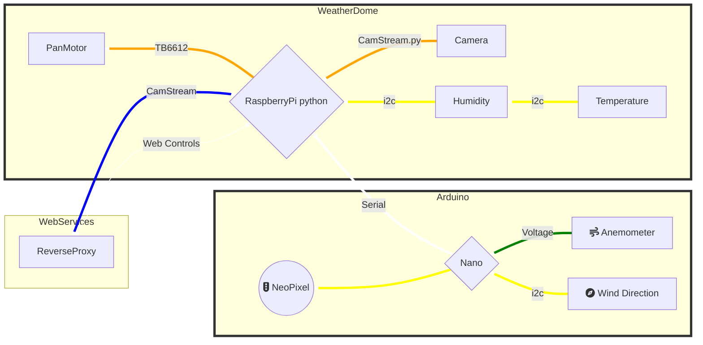
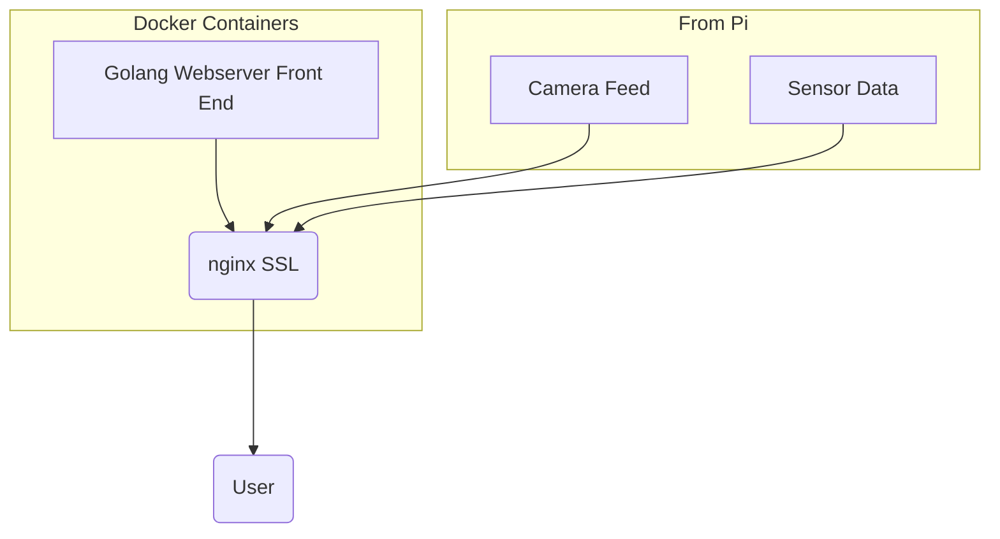

# WeatherStation
A wind direction, speed, weather conditions server with a camera stream
## Docker, Microservices, Reverse Proxy
The system is based on a raspberry pi inside of a weatherproof dome. Attached via i2c are enviromental sensors
Because the Pi lacks a simple ADC and some sensor code isn't as well supported in Python, an arduino nano is attached via USB in order to take lightning strike and windspeed readings

The pi's camera can be turned via a stepper motor.

The camera stream and sensor data are made available via a simple http endpoint which is behind a reverse proxy (dockerized nginx) in order to provide SSL termination with the possibility of caching information to limit requests of the PI

The user facing side is served via a containerized web server running Golang which is again behind the nginx proxy 

#Docker containers provide the user facing web server as well the nginx reverse proxy for SSL termination

